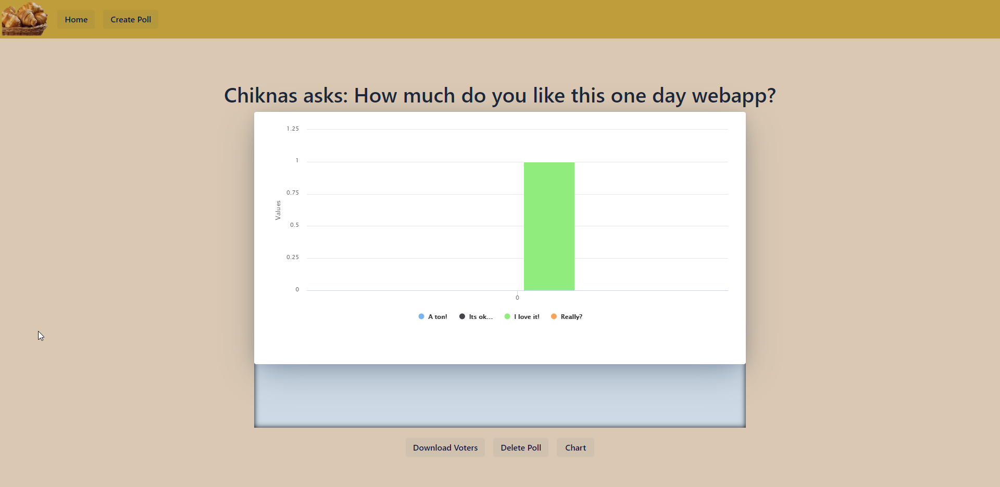
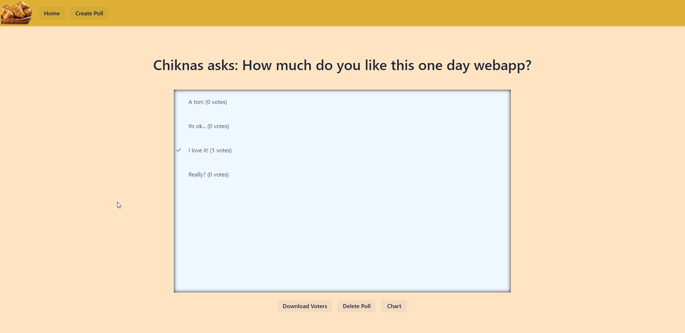

# Polls
  |    
### How to use
1. Click the Create Poll button on the top bar menu.

2. Add your name, your question and possible answers. Click the Anonymous checkbox if you are not interested in the 
person who votes. By default the voter will be asked to add his name and there us an option to download
.txt file with all the people that have voted.

3. Share the link of the poll!
